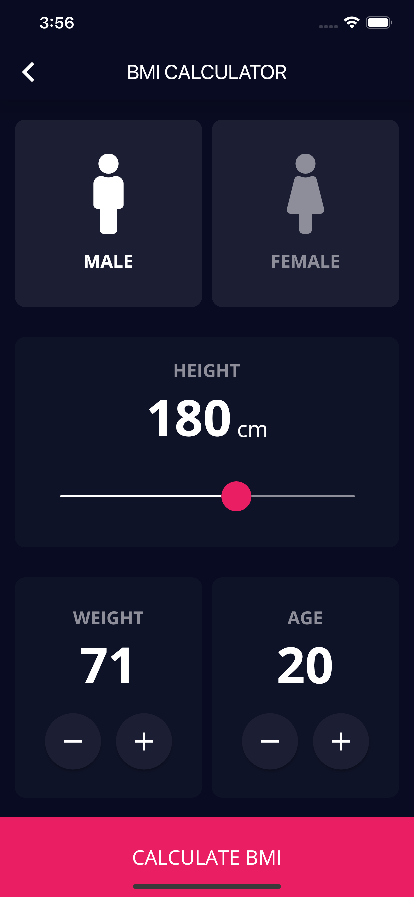

# Flutter Tutorial

Combined project for all the modules in the Udemy course
[The Complete 2020 Flutter Development Bootcamp with Dart](https://www.udemy.com/course/flutter-bootcamp-with-dart/)
by Dr. Angela Yu

## Screenshots:

|                      Profile                      |                        Dice                        |                           Xylophone                            |
|:-------------------------------------------------:|:--------------------------------------------------:|:--------------------------------------------------------------:|
|  |  |             |
|                       Quiz                        |                      Destini                       |                         BMI Calculator                         |
|     |   |  |

